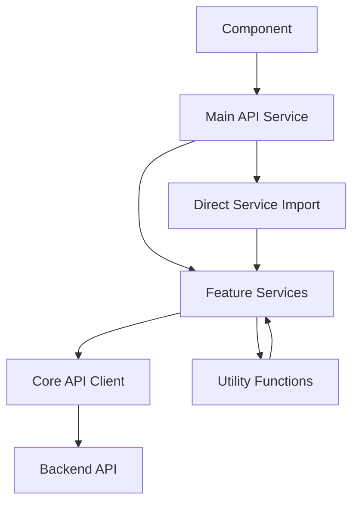

# SafeStreets API Services Documentation

## Table of Contents

1. [Overview](#overview)
2. [Architecture](#architecture)
3. [Service Reference](#service-reference)
4. [Usage Patterns](#usage-patterns)
5. [Migration Guide](#migration-guide)
6. [Best Practices](#best-practices)
7. [Error Handling](#error-handling)
8. [Performance Considerations](#performance-considerations)
9. [Testing](#testing)
10. [Troubleshooting](#troubleshooting)

## Overview

The SafeStreets API services have been modularized from a single monolithic file into a feature-based architecture. This documentation provides comprehensive information about the new modular structure, usage patterns, and migration strategies.

### Key Benefits

- **Maintainability**: Code is organized by feature, making it easier to find and modify specific functionality
- **Testability**: Individual services can be tested in isolation
- **Performance**: Tree-shaking and selective imports reduce bundle size
- **Developer Experience**: Better IDE support, clearer dependencies, and focused documentation
- **Backward Compatibility**: 100% compatible with existing code

## Architecture

### Service Hierarchy

```
SafeStreets API Services
├── api.js (Main Orchestrator)
│   ├── Maintains backward compatibility
│   ├── Delegates to feature services
│   └── Provides unified interface
├── core/
│   └── apiClient.js (HTTP Infrastructure)
│       ├── Request handling & retry logic
│       ├── Authentication headers
│       ├── Caching system
│       └── Error handling
├── features/
│   ├── authService.js (Authentication)
│   ├── reportService.js (Report Management)
│   ├── adminService.js (Admin Operations)
│   ├── safeZoneService.js (Location Intelligence)
│   └── behaviorService.js (Behavior Tracking)
└── utils/
    └── geoUtils.js (Geographic Calculations)
```

### Data Flow



## Service Reference

### Core API Client (`core/apiClient.js`)

**Purpose**: HTTP infrastructure, authentication, caching, and request handling.

#### Key Methods

```javascript
import apiClient from './services/core/apiClient.js';

// Basic HTTP requests
await apiClient.request('/endpoint', options);
await apiClient.requestWithRetry('/endpoint', options, maxRetries);
await apiClient.requestWithIntelligenceRetry('/endpoint', options, maxRetries);

// Batch operations
await apiClient.batchRequests([
  { endpoint: '/reports', options: {} },
  { endpoint: '/safezones', options: {} }
]);

// Configuration
apiClient.setDeviceFingerprint('device-123');
const headers = apiClient.getAuthHeaders();

// Health checks
await apiClient.healthCheck();
await apiClient.getApiStatus();
```

#### Configuration Properties

| Property | Type | Description |
|----------|------|-------------|
| `baseURL` | string | API base URL |
| `deviceFingerprint` | string | Current device identifier |
| `_safeZoneCache` | Map | Internal cache for safe zones |
| `_cacheExpiry` | number | Cache expiration time |

### Authentication Service (`features/authService.js`)

**Purpose**: User authentication, admin management, and security operations.

#### User Authentication

```javascript
import authService from './services/features/authService.js';

// User context and authentication
const userContext = await authService.getUserContext('device-fingerprint');

// Admin authentication
const loginResult = await authService.adminLogin({
  username: 'admin@example.com',
  password: 'securePassword'
});

await authService.adminLogout();
const isValid = await authService.verifyAdminSession();
```

#### Profile Management

```javascript
// Profile operations
const profile = await authService.getAdminProfile();
await authService.updateUserPreferences({
  language: 'en',
  notifications: true,
  theme: 'dark'
});
```

#### Security Analytics

```javascript
// Security insights
const insights = await authService.getSecurityInsights();
const analytics = await authService.getSecurityAnalytics();
```

### Report Service (`features/reportService.js`)

**Purpose**: Report CRUD operations, moderation, filtering, and community features.

#### Report Operations

```javascript
import reportService from './services/features/reportService.js';

// Submit new report
const reportData = {
  type: 'harassment',
  description: 'Incident description',
  location: {
    type: 'Point',
    coordinates: [90.4125, 23.8103] // [lng, lat]
  },
  severity: 4,
  timeOfIncident: new Date().toISOString()
};

const behaviorData = {
  submissionTime: 5000,
  interactionPattern: 'normal'
};

const result = await reportService.submitReport(reportData, behaviorData);
```

#### Report Retrieval

```javascript
// Get reports with filtering
const reports = await reportService.getReports({
  status: 'approved',
  type: 'harassment',
  limit: 50,
  offset: 0
});

// Get specific report
const report = await reportService.getReport('report-id-123');

// Advanced filtering
const filteredReports = await reportService.getReportsWithFilter({
  status: 'pending',
  severity: 'high',
  dateFrom: '2024-01-01',
  dateTo: '2024-01-31',
  location: {
    lat: 23.8103,
    lng: 90.4125,
    radius: 5000
  }
});
```

#### Moderation

```javascript
// Admin report operations
const adminReports = await reportService.getAdminReports({
  status: 'pending',
  sortBy: 'createdAt',
  sortOrder: 'desc'
});

// Moderate reports
await reportService.moderateReport(
  'report-id-123',
  'approve',
  'Verified incident',
  'high'
);

await reportService.updateReportStatus('report-id-123', 'approved');

// Bulk operations
await reportService.bulkUpdateReports(
  ['report-1', 'report-2', 'report-3'],
  'approved'
);
```

#### Community Features

```javascript
// Female safety reports
const femaleReports = await reportService.getFemaleSafetyReports();
const femaleStats = await reportService.getFemaleSafetyStats();

// Community validation
await reportService.submitCommunityValidation(
  'report-id-123',
  true, // isPositive
  {
    validatorType: 'community',
    confidence: 0.8,
    notes: 'Confirmed by local resident'
  }
);
```

#### Security Analysis

```javascript
// Security insights
const insights = await reportService.getReportSecurityInsights();
const attacks = await reportService.detectCoordinatedAttacks(3600000); // 1 hour window
```

### Admin Service (`features/adminService.js`)

**Purpose**: User management, device management, analytics, and administrative operations.

#### User Management

```javascript
import adminService from './services/features/adminService.js';

// User operations
const users = await adminService.getUsers({
  status: 'active',
  limit: 100,
  offset: 0
});

const userDetails = await adminService.getUserDetails('user-id-123');

// Quarantine operations
await adminService.quarantineUser(
  'user-id-123',
  true, // quarantine
  'Suspicious activity detected',
  48 // duration in hours
);

// Bulk quarantine
await adminService.bulkQuarantine(
  ['user-1', 'user-2', 'user-3'],
  true,
  'Coordinated spam activity'
);
```

#### Admin Management

```javascript
// Create admin users
await adminService.createAdmin({
  email: 'newadmin@example.com',
  name: 'New Admin',
  role: 'moderator',
  permissions: ['moderate_reports', 'manage_users']
});

// Update permissions
await adminService.updateAdminPermissions(
  'admin-id-123',
  ['moderate_reports', 'manage_safezones'],
  'senior_moderator'
);
```

#### Device Management

```javascript
// Device fingerprint management
const devices = await adminService.getDeviceFingerprints({
  status: 'active',
  suspicious: false
});

await adminService.quarantineDevice(
  'device-fingerprint-123',
  true,
  'Automated behavior detected'
);
```

#### Analytics and Dashboard

```javascript
// Statistics and analytics
const userStats = await adminService.getUserStatistics();
const modStats = await adminService.getModerationStats('7d');
const geoStats = await adminService.getGeographicStats();

// Dashboard data
const dashboard = await adminService.getAdminDashboard();
const analytics = await adminService.getAdminAnalytics('30d');

// Data export
const csvData = await adminService.exportReports('csv', {
  dateFrom: '2024-01-01',
  dateTo: '2024-01-31',
  status: 'approved'
});
```

### Safe Zone Service (`features/safeZoneService.js`)

**Purpose**: Safe zone management, location intelligence, and spatial analysis.

#### Public Safe Zone Queries

```javascript
import safeZoneService from './services/features/safeZoneService.js';

// Get safe zones for map display
const safeZones = await safeZoneService.getSafeZones({
  lat: 23.8103,
  lng: 90.4125,
  radius: 2000,
  minSafety: 7,
  limit: 100
});

// Get nearby safe zones
const nearby = await safeZoneService.getNearbySafeZones(
  23.8103, // lat
  90.4125, // lng
  1000,    // radius in meters
  6        // minimum safety score
);

// Get specific safe zone
const zone = await safeZoneService.getSafeZone('zone-id-123');

// Get safe zones by location
const dhakaSafeZones = await safeZoneService.getSafeZonesByLocation('Dhaka', {
  minSafety: 7,
  type: 'public'
});
```

#### Admin Safe Zone Management

```javascript
// Admin operations
const adminZones = await safeZoneService.getAdminSafeZones({
  status: 'all',
  sortBy: 'safetyScore',
  sortOrder: 'desc'
});

// Create safe zone
const newZone = await safeZoneService.createSafeZone({
  name: 'Central Park Safe Zone',
  description: 'Well-lit park with security patrol',
  location: {
    type: 'Point',
    coordinates: [90.4125, 23.8103]
  },
  safetyScore: 8.5,
  type: 'public',
  amenities: ['lighting', 'security', 'cctv'],
  operatingHours: {
    open: '06:00',
    close: '22:00'
  }
});

// Update safe zone
await safeZoneService.updateSafeZone('zone-id-123', {
  safetyScore: 9.0,
  amenities: ['lighting', 'security', 'cctv', 'emergency_button']
});

// Delete safe zone
await safeZoneService.deleteSafeZone('zone-id-123');
```

#### Bulk Operations

```javascript
// Bulk status updates
await safeZoneService.bulkUpdateSafeZoneStatus(
  ['zone-1', 'zone-2', 'zone-3'],
  'active'
);

// Batch retrieval
const batchZones = await safeZoneService.getBatchSafeZones([
  'zone-1', 'zone-2', 'zone-3'
]);

// Batch creation
const batchResults = await safeZoneService.createBatchSafeZones([
  { name: 'Zone 1', location: { coordinates: [90.41, 23.81] } },
  { name: 'Zone 2', location: { coordinates: [90.42, 23.82] } }
]);
```

#### Location Intelligence

```javascript
// Intelligent location analysis
const intelligence = await safeZoneService.getLocationIntelligence(
  23.8103,
  90.4125
);

// Area analysis
const areaAnalysis = await safeZoneService.getAreaAnalysis(
  23.8103, // lat
  90.4125, // lng
  1000     // radius in meters
);

// Route safety analysis
const routeSafety = await safeZoneService.getRouteSafetyData(
  23.8103, 90.4125, // start coordinates
  23.8203, 90.4225  // end coordinates
);
```

#### Caching and Performance

```javascript
// Cached safe zone retrieval
const cachedZones = await safeZoneService.getCachedSafeZones(
  'zones_dhaka_central',
  async () => {
    // This function is called only if cache is empty/expired
    return await safeZoneService.getSafeZones({
      location: 'Dhaka Central',
      minSafety: 7
    });
  }
);

// Clear cache when needed
safeZoneService.clearSafeZoneCache();
```

#### Safety Recommendations

```javascript
// Generate recommendations
const safetyRecs = safeZoneService.generateSafetyRecommendations(
  safeZones,
  recentReports
);

const routeRecs = safeZoneService.generateRouteRecommendations(safeZones);
```

#### Data Import/Export

```javascript
// Import safe zones
await safeZoneService.importSafeZones(
  safeZonesData,
  'government_data', // source
  false // overwrite existing
);

// Export safe zones
const exportData = await safeZoneService.exportSafeZones('json', 'active');
```

### Behavior Service (`features/behaviorService.js`)

**Purpose**: Device detection, behavior tracking, and security analysis.

#### Device Detection

```javascript
import behaviorService from './services/features/behaviorService.js';

// Detect device type
const deviceType = behaviorService.detectDeviceType();
// Returns: 'mobile', 'tablet', or 'desktop'
```

#### Behavior Tracking

```javascript
// Track user behavior
behaviorService.trackBehavior('report_start', {
  timestamp: Date.now(),
  page: '/report',
  userAgent: navigator.userAgent
});

behaviorService.trackBehavior('form_interaction', {
  field: 'description',
  duration: 2500,
  keystrokes: 45
});

// Get tracked behavior data
const behaviorData = behaviorService.getBehaviorData();

// Clear behavior data
behaviorService.clearBehaviorData();
```

#### Security Analysis

```javascript
// Generate behavior signature for security analysis
const signature = behaviorService.generateBehaviorSignature({
  submissionTime: 5000,
  interactionPattern: 'normal',
  deviceConsistency: true
});

// Analyze behavior patterns
const analysis = behaviorService.analyzeBehaviorPattern();

// Calculate human behavior score (0-100)
const humanScore = behaviorService.calculateHumanBehaviorScore(
  behaviorData,
  {
    mouseMovements: 150,
    keyboardRhythm: 'natural',
    scrollPattern: 'human'
  }
);

// Get comprehensive behavior metrics
const metrics = behaviorService.getBehaviorMetrics();
```

### Geographic Utils (`utils/geoUtils.js`)

**Purpose**: Mathematical calculations and geographic utilities.

```javascript
import { calculateDistance, calculateRouteSafetyScore } from './services/utils/geoUtils.js';

// Calculate distance between two points using Haversine formula
const distance = calculateDistance(
  23.8103, 90.4125, // point 1 (lat, lng)
  23.8203, 90.4225  // point 2 (lat, lng)
);
// Returns distance in meters

// Calculate route safety score based on safe zones
const safetyScore = calculateRouteSafetyScore(safeZones);
// Returns score from 0-10
```

## Usage Patterns

### 1. Backward Compatible Usage (Recommended for Existing Code)

```javascript
import api from './services/api.js';

// All existing code continues to work unchanged
const reports = await api.getReports();
const safeZones = await api.getSafeZones({ lat: 23.8103, lng: 90.4125 });
await api.submitReport(reportData);

// Device fingerprint propagates to all services
api.setDeviceFingerprint('device-123');
```

### 2. Direct Service Imports (New Capability)

```javascript
import reportService from './services/features/reportService.js';
import safeZoneService from './services/features/safeZoneService.js';

// Use services directly for better tree-shaking
const reports = await reportService.getReports();
const safeZones = await safeZoneService.getSafeZones({ lat: 23.8103, lng: 90.4125 });
```

### 3. Destructured Imports (Backward Compatible)

```javascript
import { getReports, getSafeZones, submitReport } from './services/api.js';

const reports = await getReports();
const safeZones = await getSafeZones({ lat: 23.8103, lng: 90.4125 });
```

### 4. Service Composition Pattern

```javascript
import reportService from './services/features/reportService.js';
import safeZoneService from './services/features/safeZoneService.js';
import { calculateDistance } from './services/utils/geoUtils.js';

class LocationAnalysisService {
  async analyzeLocation(lat, lng, radius = 1000) {
    const [reports, safeZones] = await Promise.all([
      reportService.getReports(),
      safeZoneService.getNearbySafeZones(lat, lng, radius)
    ]);

    // Filter reports by location using utility function
    const nearbyReports = reports.data?.filter(report => {
      if (!report.location?.coordinates) return false;
      
      const distance = calculateDistance(
        lat, lng,
        report.location.coordinates[1],
        report.location.coordinates[0]
      );
      
      return distance <= radius;
    });

    return {
      location: { lat, lng, radius },
      safeZones: safeZones.features || [],
      incidents: nearbyReports || [],
      safetyScore: this.calculateSafetyScore(safeZones.features, nearbyReports)
    };
  }
}
```

## Migration Guide

See [MIGRATION_GUIDE.md](./MIGRATION_GUIDE.md) for detailed migration instructions.

## Best Practices

### 1. Import Strategy

```javascript
// ✅ Good - Use direct imports for new code
import reportService from './services/features/reportService.js';
import safeZoneService from './services/features/safeZoneService.js';

// ✅ Good - Use main API for backward compatibility
import api from './services/api.js';

// ❌ Avoid - Don't mix patterns unnecessarily
import api from './services/api.js';
import reportService from './services/features/reportService.js';
// Use one or the other consistently
```

### 2. Error Handling

```javascript
try {
  const result = await reportService.submitReport(reportData);
  
  if (!result.success) {
    // Handle API-level errors
    console.error('Submission failed:', result.message);
    showUserError(result.message);
  } else {
    // Handle success
    showSuccessMessage('Report submitted successfully');
  }
} catch (error) {
  // Handle network/system errors
  console.error('Network error:', error.message);
  showUserError('Unable to submit report. Please try again.');
}
```

### 3. Device Fingerprint Management

```javascript
// Set device fingerprint once at app initialization
import api from './services/api.js';

// This propagates to all services automatically
api.setDeviceFingerprint(generateDeviceFingerprint());

// Now all service calls will include the fingerprint
const reports = await api.getReports();
```

### 4. Caching Strategy

```javascript
// Leverage service-level caching
import safeZoneService from './services/features/safeZoneService.js';

// Use cached retrieval for frequently accessed data
const safeZones = await safeZoneService.getCachedSafeZones(
  `zones_${lat}_${lng}`,
  () => safeZoneService.getNearbySafeZones(lat, lng, 2000)
);

// Clear cache when data changes
safeZoneService.clearSafeZoneCache();
```

### 5. Testing Strategy

```javascript
// Mock individual services for focused testing
import { vi } from 'vitest';
import reportService from '../services/features/reportService.js';

vi.mock('../services/features/reportService.js', () => ({
  default: {
    getReports: vi.fn(),
    submitReport: vi.fn()
  }
}));

test('should load reports', async () => {
  reportService.getReports.mockResolvedValue({ success: true, data: [] });
  
  const component = new ReportComponent();
  await component.loadReports();
  
  expect(reportService.getReports).toHaveBeenCalled();
});
```

## Error Handling

### Error Response Format

All services return consistent error responses:

```javascript
{
  success: false,
  message: "Human-readable error message",
  error: "Technical error details",
  code: "ERROR_CODE", // Optional
  details: {} // Optional additional details
}
```

### Common Error Scenarios

#### Network Errors

```javascript
try {
  const result = await reportService.getReports();
} catch (error) {
  if (error.name === 'NetworkError') {
    // Handle network connectivity issues
    showOfflineMessage();
  } else if (error.name === 'TimeoutError') {
    // Handle request timeouts
    showTimeoutMessage();
  }
}
```

#### Authentication Errors

```javascript
const result = await authService.adminLogin(credentials);

if (!result.success) {
  switch (result.code) {
    case 'INVALID_CREDENTIALS':
      showError('Invalid username or password');
      break;
    case 'ACCOUNT_LOCKED':
      showError('Account temporarily locked');
      break;
    case 'SESSION_EXPIRED':
      redirectToLogin();
      break;
    default:
      showError(result.message);
  }
}
```

#### Validation Errors

```javascript
const result = await reportService.submitReport(reportData);

if (!result.success && result.code === 'VALIDATION_ERROR') {
  // Handle field-specific validation errors
  result.details.fieldErrors.forEach(error => {
    highlightField(error.field, error.message);
  });
}
```

## Performance Considerations

### Bundle Size Optimization

```javascript
// Before: Large bundle (loads everything)
import api from './services/api.js';

// After: Smaller bundle (tree-shaking friendly)
import reportService from './services/features/reportService.js';
import safeZoneService from './services/features/safeZoneService.js';
// Only imported services are included in the bundle
```

### Caching Strategy

```javascript
// Leverage built-in caching
const safeZones = await safeZoneService.getCachedSafeZones(
  'key',
  fetchFunction
);

// Cache is shared across all usage patterns
const zones1 = await api.getSafeZones(options);        // Caches result
const zones2 = await safeZoneService.getSafeZones(options); // Uses cache
```

### Batch Operations

```javascript
// Use batch operations for multiple requests
const results = await apiClient.batchRequests([
  { endpoint: '/reports', options: {} },
  { endpoint: '/safezones', options: {} },
  { endpoint: '/analytics', options: {} }
]);

// More efficient than individual requests
```

## Testing

### Unit Testing Individual Services

```javascript
import { describe, it, expect, vi } from 'vitest';
import reportService from '../features/reportService.js';

// Mock the API client
vi.mock('../core/apiClient.js', () => ({
  default: {
    request: vi.fn(),
    setDeviceFingerprint: vi.fn()
  }
}));

describe('ReportService', () => {
  it('should submit report with behavior data', async () => {
    const mockResponse = { success: true, data: { id: '123' } };
    apiClient.request.mockResolvedValue(mockResponse);

    const result = await reportService.submitReport(reportData, behaviorData);
    
    expect(result).toEqual(mockResponse);
    expect(apiClient.request).toHaveBeenCalledWith('/reports', {
      method: 'POST',
      body: expect.stringContaining('harassment')
    });
  });
});
```

### Integration Testing

```javascript
import { describe, it, expect } from 'vitest';
import api from '../api.js';

describe('API Integration', () => {
  it('should maintain backward compatibility', async () => {
    // Test that all expected methods exist
    expect(typeof api.getReports).toBe('function');
    expect(typeof api.submitReport).toBe('function');
    expect(typeof api.getSafeZones).toBe('function');
  });

  it('should propagate device fingerprint', () => {
    const testFingerprint = 'test-device-123';
    api.setDeviceFingerprint(testFingerprint);
    
    expect(api.deviceFingerprint).toBe(testFingerprint);
  });
});
```

### Performance Testing

```javascript
import { describe, it, expect } from 'vitest';
import api from '../api.js';
import reportService from '../features/reportService.js';

describe('Performance Comparison', () => {
  it('should have similar performance to original', async () => {
    const start = performance.now();
    
    // Test both approaches
    await api.getReports();
    const mainApiTime = performance.now() - start;
    
    const directStart = performance.now();
    await reportService.getReports();
    const directTime = performance.now() - directStart;
    
    // Performance should be comparable
    expect(Math.abs(mainApiTime - directTime)).toBeLessThan(10);
  });
});
```

## Troubleshooting

### Common Issues

#### Import Path Errors

```javascript
// ❌ Wrong
import api from './services/api-old.js';

// ✅ Correct
import api from './services/api.js';
```

#### Device Fingerprint Not Set

```javascript
// ❌ Wrong - fingerprint not propagated
import reportService from './services/features/reportService.js';
await reportService.submitReport(data); // May fail without fingerprint

// ✅ Correct - set fingerprint first
import api from './services/api.js';
api.setDeviceFingerprint('device-123');
await api.submitReport(data);
```

#### Mock Configuration Issues

```javascript
// ❌ Wrong - mocking both old and new
vi.mock('./services/api-old.js');
vi.mock('./services/api.js');

// ✅ Correct - mock only what you're using
vi.mock('./services/api.js', () => ({
  default: {
    getReports: vi.fn()
  }
}));
```

### Debugging Tips

#### Enable Debug Logging

```javascript
// Add to your app initialization
if (process.env.NODE_ENV === 'development') {
  window.DEBUG_API = true;
}

// Services will log additional debug information
```

#### Check Service Health

```javascript
// Verify all services are working
const health = await api.healthCheck();
console.log('API Health:', health);

const status = await api.getApiStatus();
console.log('API Status:', status);
```

#### Compare with Original

```javascript
// If you suspect an issue, compare with original
import apiOld from './services/api-old.js';
import api from './services/api.js';

const oldResult = await apiOld.getReports();
const newResult = await api.getReports();

console.log('Results match:', JSON.stringify(oldResult) === JSON.stringify(newResult));
```

### Performance Debugging

```javascript
// Monitor performance
console.time('API Call');
const result = await api.getReports();
console.timeEnd('API Call');

// Check cache effectiveness
console.log('Cache hit rate:', safeZoneService.getCacheStats());
```

### Getting Help

1. **Check this documentation** for usage patterns and examples
2. **Review the migration guide** for step-by-step migration instructions
3. **Run the test suite** to verify functionality: `npm test`
4. **Compare with original** behavior using `api-old.js`
5. **Check individual service files** for detailed implementation
6. **Enable debug logging** for additional troubleshooting information

---

*This documentation covers the complete modular API architecture. For specific implementation details, refer to the individual service files and their inline documentation.*